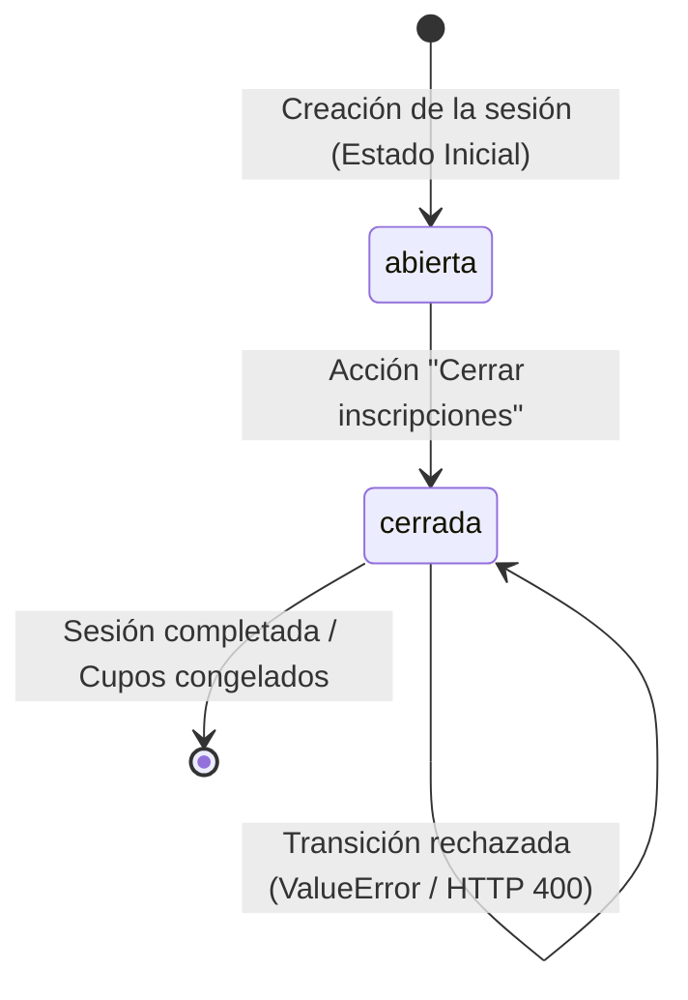

# Task 02 – Regla de Cambio de Estado y Pruebas Unitarias

## Modalidad
- **Parte 1 (sin IA):** No aplicable en esta entrega
- **Parte 2 (con IA):** Asistencia y desarrollo con Antigravity IDE (Google DeepMind)

---

## 🎯 Objetivo de la Tarea

Implementar en el proyecto **StudyMatch** una regla de negocio de **cambio de estado** sobre un elemento central de la plataforma, garantizando:
1. **Persistencia completa:** El cambio de estado se conserva tras recargar la página (`F5`) y se sincroniza en la base de datos PostgreSQL.
2. **Acción interactiva en la interfaz:** Feedback visual inmediato, estados accesibles y botón de acción según los principios de Interacción Hombre-Computador (IHC).
3. **Pruebas unitarias rigurosas:** Mínimo cuatro pruebas unitarias automatizadas que evalúen de forma aislada y determinista la máquina de estados y la integridad de los datos.

---

## 🔄 Flujo de Estado y Regla de Negocio en StudyMatch

En **StudyMatch**, los estudiantes crean sesiones grupales de estudio (*repasos, talleres de ejercicios, preparación de exámenes*). Para el estudiante organizador de la sesión, el ciclo de vida de las inscripciones sigue el siguiente flujo de estados:



### Definición de Estados:
- **`abierta` (Inscripción abierta):** Estado inicial asignado automáticamente al crear cualquier sesión de estudio. Los compañeros pueden visualizar los cupos disponibles e inscribirse.
- **`cerrada` (Inscripción cerrada):** Estado final de la inscripción alcanzado mediante la acción interactiva **"Cerrar inscripciones"**. Se congela el cupo y se previene cualquier nueva admisión.

### Reglas de Transición y Validación:
1. **Transición válida:** `abierta` $\rightarrow$ `cerrada`.
2. **Transición inválida:** `cerrada` $\rightarrow$ `cerrada` (o cualquier transición desde un estado no permitido). Es explícitamente rechazada por el dominio con una excepción `ValueError` y en la API con código HTTP `400 Bad Request`.
3. **Principio de Inmutabilidad de Atributos Complementarios:** Cambiar el estado **únicamente** modifica el campo `status`. Todos los demás atributos de la sesión (`id`, `name`, `date`, `modality`, `spots`, `created_at`) permanecen inalterados.

---

## 💻 Implementación Técnica

### 1. Modelo de Datos y Dominio (`backend/app/models.py`)
Se añadió la columna `status` con valor predeterminado `'abierta'` y el método de dominio `close_registration()`:

```python
class Session(Base):
    __tablename__ = "sessions"

    id = Column(Integer, primary_key=True, index=True)
    name = Column(String(150), nullable=False)
    date = Column(Date, nullable=False)
    modality = Column(String(50), nullable=False)
    spots = Column(Integer, nullable=False)
    status = Column(String(30), default="abierta", nullable=False)
    created_at = Column(DateTime(timezone=True), server_default=func.now())

    def close_registration(self):
        """
        Regla de negocio: Transición de estado para cerrar inscripciones.
        Flujo permitido: 'abierta' -> 'cerrada'.
        Si la sesión ya está cerrada o en otro estado, la transición se rechaza.
        """
        if self.status != "abierta":
            raise ValueError(
                f"Transición inválida: No se pueden cerrar inscripciones de una sesión con estado '{self.status}'. Solo se permite desde 'abierta'."
            )
        self.status = "cerrada"
        return self

    @property
    def is_open(self) -> bool:
        return self.status == "abierta"
```

### 2. Endpoints RESTful (`backend/app/routers/sessions.py`)
Se implementó el endpoint especializado `PATCH /sessions/{session_id}/close` para invocar la acción de negocio:

```python
@router.patch("/{session_id}/close", response_model=SessionResponse)
def close_session_registration(session_id: int, db: DBSession = Depends(get_db)):
    session = db.query(Session).filter(Session.id == session_id).first()
    if not session:
        raise HTTPException(status_code=404, detail="Sesión no encontrada")

    try:
        session.close_registration()
    except ValueError as e:
        raise HTTPException(status_code=400, detail=str(e))

    db.commit()
    db.refresh(session)
    return session
```

### 3. Migración Automática en Base de Datos (`backend/app/triggers.py`)
```sql
ALTER TABLE sessions ADD COLUMN IF NOT EXISTS status VARCHAR(30) DEFAULT 'abierta';
UPDATE sessions SET status = 'abierta' WHERE status IS NULL;
```

### 4. Interfaz de Usuario e Interacción Humano-Computador (`frontend/src/pages/Dashboard.jsx`)
- **Acción interactiva:** Botón `"🔒 Cerrar inscripciones"` que dispara la transición.
- **Badges de estado:**
  - `abierta`: `🟢 Inscripción abierta`.
  - `cerrada`: `🔒 Cerrada`.
- **Persistencia comprobada:** Al presionar `F5` o recargar el navegador, el `useEffect` invoca `GET /sessions/`, recuperando el estado directamente desde PostgreSQL.

---

## 🧪 Pruebas Unitarias Automatizadas (`backend/tests/test_session_state.py`)

Se implementó la suite de pruebas unitarias cubriendo los **cuatro requisitos obligatorios**:

| ID | Nombre de la Prueba | Descripción del Caso de Prueba | Resultado |
|----|---------------------|--------------------------------|-----------|
| **1** | `test_01_estado_inicial_es_correcto` | Verifica que toda sesión creada comience con el estado `'abierta'` y `is_open == True`. | ✅ APROBADA |
| **2** | `test_02_accion_realiza_transicion_esperada` | Verifica que invocar `close_registration()` cambie el estado de `'abierta'` a `'cerrada'`. | ✅ APROBADA |
| **3** | `test_03_transicion_invalida_se_rechaza` | Verifica que intentar cerrar una sesión ya cerrada lance `ValueError` y conserve `'cerrada'`. | ✅ APROBADA |
| **4** | `test_04_demas_datos_del_elemento_se_conservan` | Comprueba que tras cambiar el estado, `id`, `name`, `date`, `modality`, `spots` sigan intactos. | ✅ APROBADA |

---

## 📋 Comandos para Ejecutar las Pruebas

```bash
cd backend
python -m pytest -v
```

---

## 📊 Evidencia de Ejecución Exitosa

### Salida real en consola (`pytest -v`):
```text
============================= test session starts =============================
platform win32 -- Python 3.10.11, pytest-9.1.1, pluggy-1.6.0
rootdir: D:\INTERACCION HOMBRE-COMPUTADOR\Segundo Proyecto\backend
collected 4 items

tests/test_session_state.py::TestSessionStateTransitions::test_01_estado_inicial_es_correcto PASSED [ 25%]
tests/test_session_state.py::TestSessionStateTransitions::test_02_accion_realiza_transicion_esperada PASSED [ 50%]
tests/test_session_state.py::TestSessionStateTransitions::test_03_transicion_invalida_se_rechaza PASSED [ 75%]
tests/test_session_state.py::TestSessionStateTransitions::test_04_demas_datos_del_elemento_se_conservan PASSED [100%]

============================== 4 passed in 0.40s ==============================
```

### Salida real en consola (`unittest discover -v`):
```text
test_01_estado_inicial_es_correcto (test_session_state.TestSessionStateTransitions)
Prueba 1: El estado inicial es el correcto. ... ok
test_02_accion_realiza_transicion_esperada (test_session_state.TestSessionStateTransitions)
Prueba 2: La acción realiza la transición esperada. ... ok
test_03_transicion_invalida_se_rechaza (test_session_state.TestSessionStateTransitions)
Prueba 3: Una transición inválida se rechaza. ... ok
test_04_demas_datos_del_elemento_se_conservan (test_session_state.TestSessionStateTransitions)
Prueba 4: Los demás datos del elemento se conservan. ... ok

----------------------------------------------------------------------
Ran 4 tests in 0.004s

OK
```

---

## 📁 Archivos Modificados e Incorporados

```
Segundo Proyecto/
├── backend/
│   ├── app/
│   │   ├── models.py                   ← Campo status + método close_registration()
│   │   ├── schemas.py                  ← Validación status en SessionCreate/Response
│   │   ├── routers/sessions.py         ← Endpoint PATCH /sessions/{id}/close
│   │   ├── triggers.py                 ← Migración idempotente para columna status
│   │   └── database.py                 ← Corrección de imports SQLAlchemy 2.0
│   ├── tests/
│   │   ├── __init__.py                 ← Módulo de pruebas unitarias
│   │   └── test_session_state.py       ← 4 pruebas unitarias de cambio de estado
│   └── requirements.txt                ← Dependencias de prueba (pytest, httpx)
├── frontend/src/
│   ├── pages/Dashboard.jsx             ← Botón "Cerrar inscripciones", badges y toasts
│   └── styles/Dashboard.css            ← Estilos IHC para badges, botones y feedback
├── README.md                           ← Documentación de comandos de prueba
└── docs/
    └── task-02-state-tests.md          ← Este documento de entrega
```
